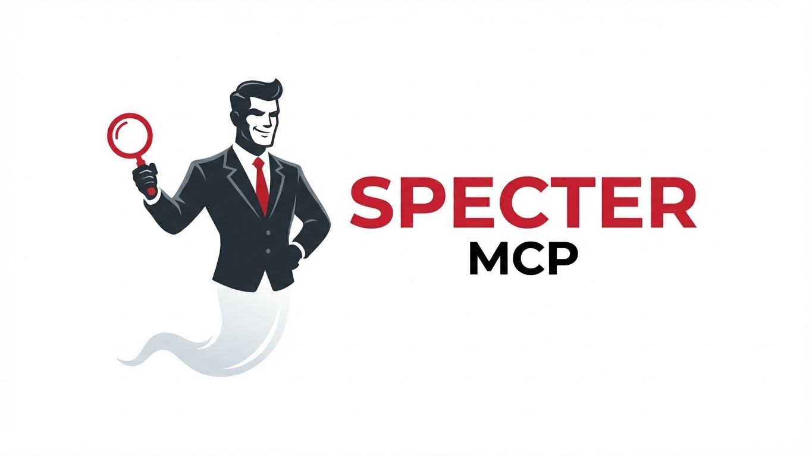

<p align="center">
  
</p>

<h1 align="center">Specter MCP</h1>

<p align="center">
  <strong>KMM Diagnostic & Execution Engine</strong><br>
  An MCP server providing "hands and eyes" for AI agents working with Kotlin Multiplatform Mobile projects.
</p>

<p align="center">
  <a href="https://www.npmjs.com/package/specter-mcp"></a>
  <a href="https://www.npmjs.com/package/specter-mcp"></a>
  <a href="https://github.com/abd3lraouf/specter-mcp/blob/main/LICENSE"></a>
  <a href="https://nodejs.org/"></a>
</p>

---

## Overview

Specter MCP enables AI agents to build, test, debug, and interact with Android and iOS applications through a standardized [Model Context Protocol (MCP)](https://modelcontextprotocol.io) interface. It provides 15 specialized tools organized into categories for complete mobile development automation.

## Features

- **Build Pipeline** — Build, install, and launch apps on Android/iOS
- **UI Automation** — Capture screenshots, UI hierarchies, and perform interactions
- **Testing** — Run unit tests, Maestro E2E flows, and linters
- **Environment Management** — List/boot devices, clean projects
- **Crash Analysis** — Cross-platform crash analysis (iOS crash files + symbolication, Android logcat)
- **Deep Linking** — Navigate apps via deep links with intent extras
- **App State Inspection** — Read preferences, databases, and logs

## Quick Start

### Installation

```bash
npm install -g specter-mcp
```

### Claude Desktop Configuration

Add to `~/Library/Application Support/Claude/claude_desktop_config.json` (macOS):

```json
{
  "mcpServers": {
    "specter-mcp": {
      "command": "specter-mcp"
    }
  }
}
```

Restart Claude Desktop. Ask Claude: *"List my available Android and iOS devices"*

## Documentation

- [Getting Started](./docs/getting-started.md)
- [Configuration Guide](./docs/configuration.md)
- [API Reference](./docs/API.md)

### Tool Guides

- [Build Tools](./docs/tools/build-tools.md) — build_app, install_app, launch_app
- [UI Tools](./docs/tools/ui-tools.md) — get_ui_context, interact_with_ui
- [Testing Tools](./docs/tools/testing-tools.md) — run_unit_tests, run_maestro_flow, run_linter
- [Environment Tools](./docs/tools/environment-tools.md) — list_devices, manage_env, clean_project
- [Observability Tools](./docs/tools/observability-tools.md) — analyze_crash, inspect_logs, inspect_app_state, deep_link_navigate

## Available Tools

| Category | Tools |
|----------|-------|
| **Build** | `build_app` `install_app` `launch_app` |
| **UI** | `get_ui_context` `interact_with_ui` |
| **Testing** | `run_unit_tests` `run_maestro_flow` `run_linter` |
| **Environment** | `list_devices` `manage_env` `clean_project` |
| **Observability** | `analyze_crash` `inspect_logs` `inspect_app_state` `deep_link_navigate` |

## Example Usage

### Build and Launch

```
You: Build my Android app and launch it on the emulator

Claude: I'll build and launch your app.
[Uses build_app, install_app, launch_app]
```

### Debug a Crash

```
You: My iOS app is crashing. What's wrong?

Claude: Let me analyze the crash logs.
[Uses analyze_crash, inspect_logs]
```

### UI Automation

```
You: Take a screenshot and tap the login button

Claude: I'll capture the UI and perform the tap.
[Uses get_ui_context, interact_with_ui]
```

## Requirements

- **Node.js 20+**
- **Android SDK** with `adb` in PATH (for Android tools)
- **Xcode Command Line Tools** (for iOS tools, macOS only)
- **Maestro CLI** (optional, for E2E testing)

## Development

```bash
# Clone and install
git clone https://github.com/abd3lraouf/specter-mcp.git
cd specter-mcp
npm install

# Build
npm run build

# Test
npm test
npm run test:coverage

# Lint
npm run lint
npm run typecheck
```

## Architecture

```
src/
├── index.ts              # MCP server entry point
├── config.ts             # Environment configuration
├── models/               # Type definitions and errors
├── platforms/            # Android/iOS platform utilities
│   ├── android/          # ADB, Gradle, logcat, preferences
│   └── ios/              # simctl, xcodebuild, oslog, crash parsing
├── queue/                # Request queue and executor
├── routing/              # Model routing dispatcher
├── tools/                # MCP tool implementations
└── utils/                # Shell execution, image processing
```

## Contributing

See [CONTRIBUTING.md](./CONTRIBUTING.md) for development setup and guidelines.

## License

[MIT](./LICENSE) © Specter MCP Contributors
